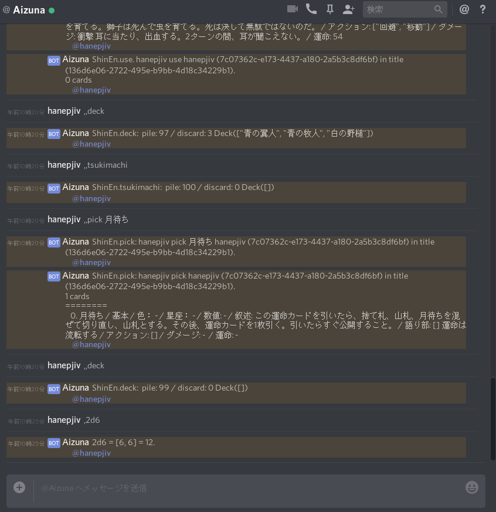

# Aizuna 0.1

* 

Aizunaはチャットツール上でテーブルトークRPGを遊ぶための支援ツールです。
サーバとして動作し、チャットと連携して各データを管理します。

名前の由来であるアイズナが示すようにテーブルトークRPG
『[深淵](https://ja.wikipedia.org/wiki/%E6%B7%B1%E6%B7%B5_(%E3%82%B2%E3%83%BC%E3%83%A0))』
のカードをチャット上で管理する目的で開発されました。
アイズナは『深淵』でネズミ使いが操る魔力あるネズミの名前です。ネズミ使い自身もアイズナと呼ばれます。

[Rust][Rust] nightlyで記述されています。

Aizuna 0.1 では チャットサービスの [Discord][Discord] を対象として動作します。

##### Author

* hanepjiv
    * mail:  <hanepjiv@gmail.com>
    * twitter: [@hanepjiv](https://twitter.com/hanepjiv)
    * blog: [https://hanepjiv.blogspot.jp/](https://hanepjiv.blogspot.jp/)

##### Repository

[https://github.com/hanepjiv/aizuna.git](https://github.com/hanepjiv/aizuna.git)

##### License

* MIT
* Apache-2.0

### 機能

* ユーザ管理
* セッション管理
* サイコロ
* 『深淵』
    * カード管理

#### 接続
Aizuna 0.1 では 下記の接続で動作します。

- デバッグ コンソール
- [Discord][Discord]

### 動作環境

* [Rust][Rust] nightly

#### 動作確認環境

* Linux(libc)

#### 依存ライブラリ

[Cargo.toml](https://github.com/hanepjiv/aizuna/blob/master/Cargo.toml)
を参照してください。

{{#include link.md}}
